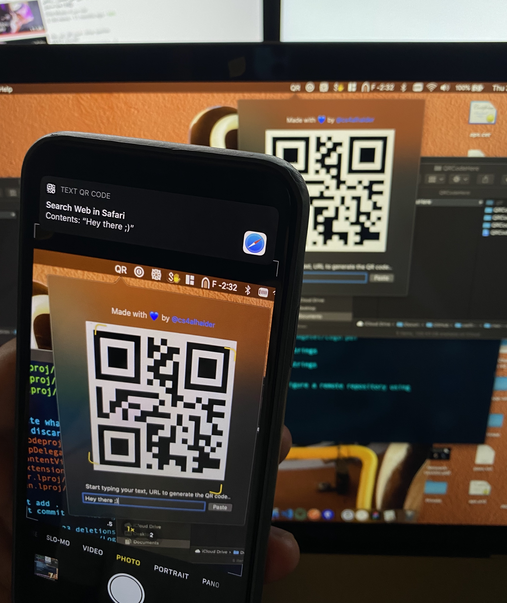

# QRCodeHere
Light macOS app to send text, urls and passwords directly to your phone using QR codes 

| macOS app screenshot | How to use? 🤕 |
| --- | --- |
|  |  |

## How to install?
Simply download this by clicking on the green button (Clone or download -> Download ZIP) and navigate to `Assets` folder and you will find `QRCodeHere.app`, just copy it to your mac `Application` folder and then run it ☺️

## Author

Abdullah Alhaider, [Twitter](https://twitter.com/cs4alhaider). 

## License

This project is under the MIT license. See the LICENSE file for more info.