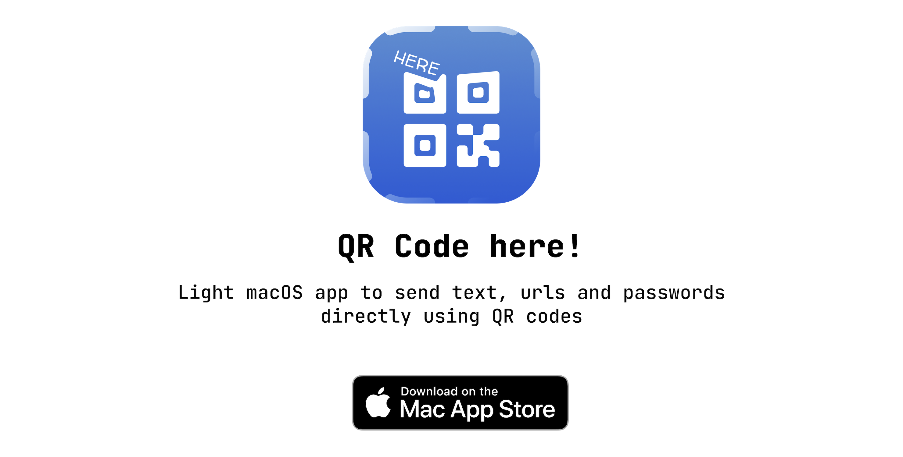

	
	 
	 
	 

## Installation

To try **QR Code Here** yourself, either get it directly from the [Mac App Store](https://apps.apple.com/sa/app/qr-code-here/id1577042983?mt=12) or download the code and build it through Xcode. It’s built using SwiftUI, so you’ll need macOS Big Sur in order to run it. 

**Warning:** SwiftUI on macOS is a little flaky at times, so I highly recommend you update to the very latest macOS version if you want to avoid any surprises.

## Contribution guide

Any help you can offer with this project is most welcome – there are opportunities big and small so that someone with only a small amount of Swift experience can help.

Some suggestions you might want to explore:

- Adding support to change the QR code look.
- Addng support to add a logo inside the QR code.
- Adding support to change the font.
- Adding support for [SwiftLint](https://github.com/realm/SwiftLint).
- Add documentation in the code or here in the README.
- Did I mention handling errors in a meaningful way?

You’re also welcome to try adding some tests, although given our underlying use of `CIFilter` that might be tricky.

If you spot any errors please open an issue and let us know which macOS and Xcode versions you’re using.

## Example

| 🖥 Example to scan a QR code using iPhone camera📱 |
| --- |
|  |

## Credits

**QR Code Here** was originally designed and built by [Abdullah Alhaider](https://github.com/cs4alhaider), and is copyright © Abdullah Alhaider 2021. The icon was designed by Abdullah Alhaider.

**QR Code Here** is licensed under the MIT license; for the full license please see the [LICENSE file](LICENSE). Also, [Abdulaziz Alobaili](https://twitter.com/alobaili) has contributed features, fixes, and more to make **QR Code Here** what it is today. 

If you find **QR Code Here** useful, you might find my other apps also useful and you can support me [on App Store](https://apps.apple.com/us/developer/abdullah-alhaider/id1332762194).

